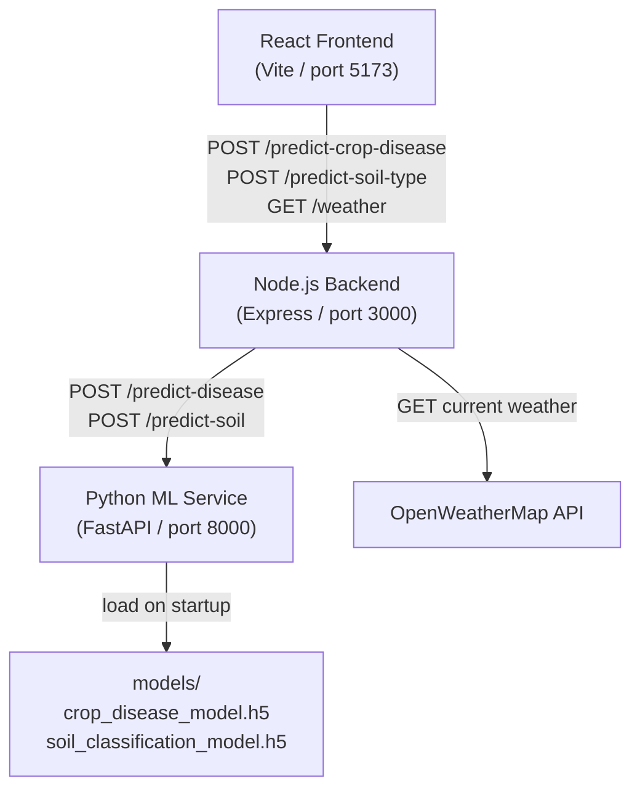
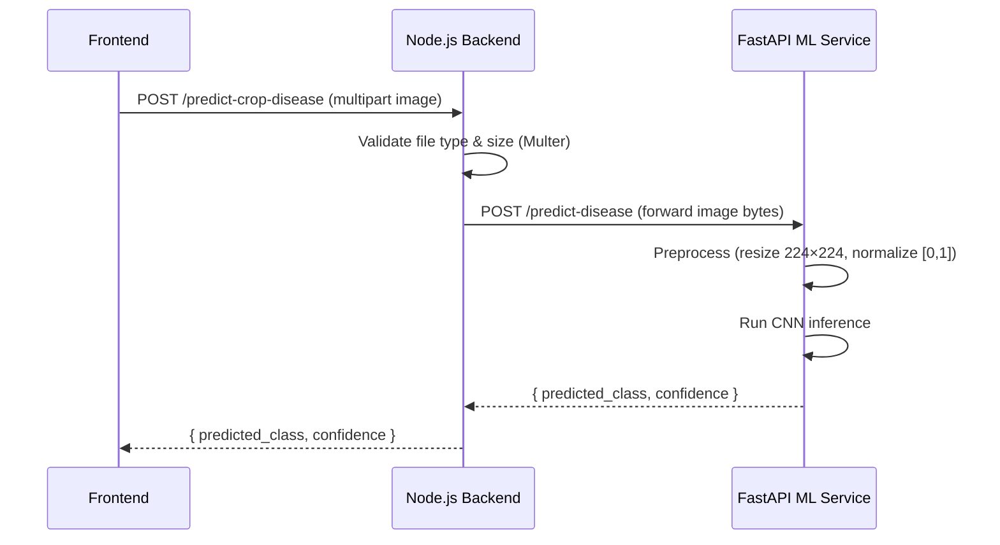
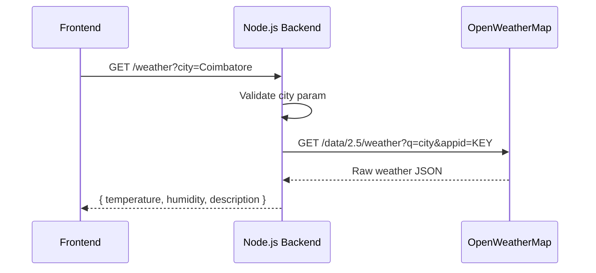

# Design Document: TechTrack Smart Agriculture

## Overview

TechTrack is an AI-powered smart agriculture platform. The existing React frontend (Vite + React + shadcn/ui) communicates with a **Node.js Express backend** that acts as the API gateway. The backend proxies image prediction requests to a **Python FastAPI ML service** and fetches weather data from OpenWeatherMap. Two TensorFlow CNN models handle crop disease detection and soil type classification.

This document covers the backend and ML service design only. The frontend already exists at `src/`.

### Technology Stack

| Layer | Technology |
|---|---|
| Frontend | React 18, Vite, TypeScript, TailwindCSS, shadcn/ui |
| Backend | Node.js 20+, Express 4, Multer, Axios |
| ML Service | Python 3.10+, FastAPI, TensorFlow 2.x, Pillow |
| Weather | OpenWeatherMap Current Weather API |
| Model Format | Keras `.h5` |

---

## Architecture



### Request Flow — Image Prediction



### Request Flow — Weather



---

## Components and Interfaces

### Node.js Backend Components

#### `app.js` — Express Application Entry Point
- Initialises Express, registers middleware (CORS, JSON body parser, Multer), mounts routers, registers the 404 and global error handlers.
- Reads `PORT` from environment (default `3000`).

#### `routes/cropDisease.js`
- Mounts at `POST /predict-crop-disease`.
- Uses the shared `imageUpload` Multer instance.
- Delegates to `services/mlService.js`.

#### `routes/soilType.js`
- Mounts at `POST /predict-soil-type`.
- Uses the shared `imageUpload` Multer instance.
- Delegates to `services/mlService.js`.

#### `routes/weather.js`
- Mounts at `GET /weather`.
- Delegates to `services/weatherService.js`.

#### `middleware/upload.js`
- Configures Multer with `memoryStorage` (no disk writes).
- Enforces MIME type filter: `image/jpeg`, `image/png`.
- Enforces file size limit: 10 MB.
- Exports a single `imageUpload` middleware instance.

#### `services/mlService.js`
- `predictCropDisease(imageBuffer, mimetype)` — POSTs image to `ML_SERVICE_URL/predict-disease` via Axios with `multipart/form-data`.
- `predictSoilType(imageBuffer, mimetype)` — POSTs image to `ML_SERVICE_URL/predict-soil`.
- Both functions throw a typed `ServiceUnavailableError` when Axios cannot reach the ML service.

#### `services/weatherService.js`
- `getWeather(city)` — GETs `https://api.openweathermap.org/data/2.5/weather?q={city}&units=metric&appid={KEY}`.
- Maps the raw response to `{ temperature, humidity, description }`.
- Throws typed errors for missing city, city-not-found, and API unavailability.

#### `middleware/errorHandler.js`
- Global Express error handler.
- Maps typed errors to HTTP status codes and JSON error bodies.

### Python ML Service Components

#### `main.py` — FastAPI Application Entry Point
- Creates the FastAPI app, registers routers, loads models at startup via `lifespan` event.

#### `routers/disease.py`
- `POST /predict-disease` — accepts `UploadFile`, calls `preprocess.prepare_image`, runs inference with the crop disease model.

#### `routers/soil.py`
- `POST /predict-soil` — accepts `UploadFile`, calls `preprocess.prepare_image`, runs inference with the soil model.

#### `services/preprocess.py`
- `prepare_image(file_bytes) -> np.ndarray` — decodes bytes with Pillow, resizes to 224×224, converts to RGB, normalises to `[0, 1]`, returns shape `(1, 224, 224, 3)`.

#### `services/model_loader.py`
- `load_models()` — loads both `.h5` files at startup and stores them as module-level singletons.
- Returns `None` for a model if the file is missing; the router returns 503 in that case.

#### `schemas.py`
- `PredictionResponse` — Pydantic model: `predicted_class: str`, `confidence: float`.

---

## Data Models

### Prediction Response (shared contract)

```json
{
  "predicted_class": "Early Blight",
  "confidence": 0.85
}
```

| Field | Type | Constraints |
|---|---|---|
| `predicted_class` | string | Non-empty; one of the trained class labels |
| `confidence` | float | `0.0 ≤ confidence ≤ 1.0` |

### Weather Response

```json
{
  "temperature": 32.4,
  "humidity": 65,
  "description": "clear sky"
}
```

| Field | Type | Source |
|---|---|---|
| `temperature` | float (°C) | `main.temp` |
| `humidity` | integer (%) | `main.humidity` |
| `description` | string | `weather[0].description` |

### Error Response (all error cases)

```json
{
  "error": "Invalid file type. Only JPEG and PNG are accepted."
}
```

### Image Preprocessing Tensor

| Property | Value |
|---|---|
| Shape | `(1, 224, 224, 3)` |
| Dtype | `float32` |
| Value range | `[0.0, 1.0]` |
| Channel order | RGB |

---

## Folder Structure

```
techtrack/
├── backend/                        # Node.js Express API
│   ├── src/
│   │   ├── app.js                  # Express app setup, middleware, routers
│   │   ├── server.js               # HTTP server entry point (reads PORT)
│   │   ├── routes/
│   │   │   ├── cropDisease.js      # POST /predict-crop-disease
│   │   │   ├── soilType.js         # POST /predict-soil-type
│   │   │   └── weather.js          # GET /weather
│   │   ├── middleware/
│   │   │   ├── upload.js           # Multer config (memoryStorage, type+size filter)
│   │   │   └── errorHandler.js     # Global Express error handler
│   │   └── services/
│   │       ├── mlService.js        # Axios calls to FastAPI ML service
│   │       └── weatherService.js   # OpenWeatherMap API integration
│   ├── package.json
│   └── .env.example                # PORT, ML_SERVICE_URL, OPENWEATHER_API_KEY
│
├── ml_service/                     # Python FastAPI ML service
│   ├── main.py                     # FastAPI app, lifespan model loading
│   ├── schemas.py                  # Pydantic PredictionResponse model
│   ├── routers/
│   │   ├── disease.py              # POST /predict-disease
│   │   └── soil.py                 # POST /predict-soil
│   ├── services/
│   │   ├── preprocess.py           # Image resize + normalize pipeline
│   │   └── model_loader.py         # Load .h5 models at startup
│   ├── models/                     # Trained model files (gitignored)
│   │   ├── crop_disease_model.h5
│   │   └── soil_classification_model.h5
│   ├── requirements.txt
│   └── .env.example
│
├── training/                       # Model training scripts
│   ├── train_crop_disease.py       # CNN training for crop disease
│   ├── train_soil_type.py          # CNN training for soil classification
│   └── requirements.txt
│
├── datasets/                       # Kaggle datasets (gitignored)
│   ├── crop_disease/               # jawadali1045/20k-multi-class-crop-disease-images
│   │   ├── class_a/
│   │   └── class_b/
│   └── soil_images/                # jayaprakashpondy/soil-image-dataset
│       ├── Alluvial Soil/
│       └── Black Soil/
│
└── src/                            # Existing React frontend (unchanged)
    └── ...
```

### Environment Variables

**`backend/.env`**

```
PORT=3000
ML_SERVICE_URL=http://localhost:8000
OPENWEATHER_API_KEY=your_key_here
```

**`ml_service/.env`** (optional, for future auth)

```
PORT=8000
```

---

## API Reference

### Backend Endpoints

| Method | Path | Description |
|---|---|---|
| `POST` | `/predict-crop-disease` | Upload crop image → disease prediction |
| `POST` | `/predict-soil-type` | Upload soil image → soil type prediction |
| `GET` | `/weather?city={city}` | Fetch current weather for a city |

#### POST /predict-crop-disease

- Content-Type: `multipart/form-data`
- Field name: `image`
- Max size: 10 MB
- Accepted types: JPEG, PNG

**Success 200:**
```json
{ "predicted_class": "Early Blight", "confidence": 0.85 }
```

**Error responses:**

| Status | Condition | Message |
|---|---|---|
| 400 | Wrong file type | `"Invalid file type. Only JPEG and PNG are accepted."` |
| 413 | File > 10 MB | `"File too large. Maximum size is 10MB."` |
| 503 | ML service down | `"ML service unavailable."` |

#### POST /predict-soil-type

Same contract as `/predict-crop-disease`, forwarded to `/predict-soil`.

#### GET /weather

| Status | Condition | Message |
|---|---|---|
| 200 | OK | `{ temperature, humidity, description }` |
| 400 | Missing city | `"City parameter is required."` |
| 404 | City not found | `"City not found."` |
| 503 | API down / bad key | `"Weather service unavailable."` |

### ML Service Endpoints

| Method | Path | Description |
|---|---|---|
| `POST` | `/predict-disease` | Preprocess image + run crop disease CNN |
| `POST` | `/predict-soil` | Preprocess image + run soil type CNN |

Both accept `multipart/form-data` with field `file` and return `PredictionResponse`.

---

## CNN Model Architecture

Both models share the same architecture template, differing only in the number of output classes.

```
Input (224, 224, 3)
  └─ Conv2D(32, 3×3, relu) → MaxPooling2D(2×2)
  └─ Conv2D(64, 3×3, relu) → MaxPooling2D(2×2)
  └─ Conv2D(128, 3×3, relu) → MaxPooling2D(2×2)
  └─ Flatten
  └─ Dense(256, relu) → Dropout(0.5)
  └─ Dense(num_classes, softmax)
```

- Loss: `categorical_crossentropy`
- Optimizer: `Adam`
- Epochs: 10
- Input normalization: pixel values ÷ 255 → `[0, 1]`
- Train/validation split: 80/20

---


## Correctness Properties

*A property is a characteristic or behavior that should hold true across all valid executions of a system — essentially, a formal statement about what the system should do. Properties serve as the bridge between human-readable specifications and machine-verifiable correctness guarantees.*

### Property 1: Unknown routes return 404 JSON

*For any* HTTP request path that does not match a registered route on the backend, the response status SHALL be 404 and the body SHALL be a JSON object containing an `error` field.

**Validates: Requirements 1.3**

---

### Property 2: Image prediction proxy round-trip

*For any* valid JPEG or PNG image uploaded to either `/predict-crop-disease` or `/predict-soil-type`, the backend SHALL return a `Prediction_Response` JSON object whose `predicted_class` and `confidence` values are identical to those returned by the ML service — no transformation or re-encoding of the response.

**Validates: Requirements 2.2, 3.2, 11.3**

---

### Property 3: Invalid file type rejected at both prediction endpoints

*For any* file upload whose MIME type is not `image/jpeg` or `image/png`, submitting it to either `/predict-crop-disease` or `/predict-soil-type` SHALL result in a 400 response with the message `"Invalid file type. Only JPEG and PNG are accepted."` and the ML service SHALL NOT be contacted.

**Validates: Requirements 2.3, 3.3**

---

### Property 4: Weather response contains all required fields

*For any* valid city name accepted by OpenWeatherMap, the `GET /weather` response SHALL be a JSON object containing `temperature` (number, °C), `humidity` (integer, %), and `description` (non-empty string).

**Validates: Requirements 4.2**

---

### Property 5: Missing or empty city parameter returns 400

*For any* `GET /weather` request where the `city` query parameter is absent or is an empty string, the response SHALL be 400 with the message `"City parameter is required."`.

**Validates: Requirements 4.3**

---

### Property 6: Preprocessing produces valid normalized tensor

*For any* valid JPEG or PNG image file, the `prepare_image` function SHALL return a NumPy array of shape `(1, 224, 224, 3)` with dtype `float32` and all values in the closed interval `[0.0, 1.0]`.

**Validates: Requirements 5.2, 6.2, 9.1, 9.3**

---

### Property 7: Preprocessing is idempotent after first application

*For any* image tensor already produced by `prepare_image` (i.e., shape `(1, 224, 224, 3)`, values in `[0, 1]`), applying `prepare_image` a second time SHALL produce a tensor with values equal to the first application's output.

**Validates: Requirements 9.2**

---

### Property 8: Prediction response structure is valid for all inputs

*For any* valid image accepted by the ML service at `/predict-disease` or `/predict-soil`, the response SHALL be a JSON object where `predicted_class` is a non-empty string and `confidence` is a float satisfying `0.0 ≤ confidence ≤ 1.0`.

**Validates: Requirements 5.4, 6.4**

---

### Property 9: Invalid image bytes return 400 from ML service

*For any* byte sequence that cannot be decoded as a valid image by Pillow, submitting it to `/predict-disease` or `/predict-soil` SHALL return a 400 response with the message `"Invalid image file."`.

**Validates: Requirements 5.6, 6.6**

---

### Property 10: Training dataset split preserves 80/20 ratio

*For any* dataset directory with N total samples, the training script SHALL produce a training set of size `floor(0.8 * N)` ± 1 and a validation set of size `ceil(0.2 * N)` ± 1, with no sample appearing in both sets.

**Validates: Requirements 7.2, 8.2**

---

## Error Handling

### Backend Error Taxonomy

| Error Class | HTTP Status | Trigger |
|---|---|---|
| `ValidationError` | 400 | Wrong file type, missing/empty city param |
| `FileTooLargeError` | 413 | File exceeds 10 MB (Multer `limits.fileSize`) |
| `NotFoundError` | 404 | Undefined route, city not found in OWM |
| `ServiceUnavailableError` | 503 | ML service unreachable, OWM API down/bad key |
| Unhandled exception | 500 | Any unexpected error in route handlers |

All error responses use the shape `{ "error": "<message>" }`.

The global `errorHandler.js` middleware catches all errors thrown or passed via `next(err)` and maps them to the appropriate status code and message. Unrecognised errors fall through to 500.

### ML Service Error Handling

| Condition | HTTP Status | Message |
|---|---|---|
| Model file missing at startup | 503 | `"Model not available"` |
| Pillow cannot decode image bytes | 400 | `"Invalid image file."` |
| Unexpected inference error | 500 | `"Internal server error"` |

Model availability is checked per-request using the singleton loaded at startup. If `model_loader.load_models()` returned `None` for a model, the corresponding router immediately returns 503 without attempting inference.

### Multer Error Handling

Multer raises `MulterError` with code `LIMIT_FILE_SIZE` when the file exceeds the configured limit. The global error handler maps this to 413. The file filter callback raises a custom `ValidationError` for unsupported MIME types, which maps to 400.

---

## Testing Strategy

### Dual Testing Approach

Both unit tests and property-based tests are required. They are complementary:
- **Unit tests** verify specific examples, integration points, and error conditions.
- **Property-based tests** verify universal invariants across many generated inputs.

### Backend Testing (Node.js)

**Framework:** Vitest (already in the project) + Supertest for HTTP integration tests.
**Property-based library:** `fast-check` (TypeScript/JavaScript PBT library).

Unit test targets:
- `weatherService.js` — mock Axios, verify field mapping and error propagation.
- `mlService.js` — mock Axios, verify proxy behaviour and 503 on connection error.
- `errorHandler.js` — verify each error class maps to the correct status code.
- Route integration tests via Supertest — one test per acceptance criteria example.

Property test targets (minimum 100 iterations each):
- **Property 1** — generate random path strings, assert 404 JSON.
  - Tag: `Feature: techtrack-smart-agriculture, Property 1: Unknown routes return 404 JSON`
- **Property 3** — generate random non-image MIME types, assert 400 at both endpoints.
  - Tag: `Feature: techtrack-smart-agriculture, Property 3: Invalid file type rejected at both prediction endpoints`
- **Property 5** — generate empty/whitespace/absent city params, assert 400.
  - Tag: `Feature: techtrack-smart-agriculture, Property 5: Missing or empty city parameter returns 400`

### ML Service Testing (Python)

**Framework:** pytest.
**Property-based library:** Hypothesis (Python PBT library).

Unit test targets:
- `preprocess.prepare_image` — test with known JPEG and PNG fixtures, verify shape and range.
- `model_loader.load_models` — test with missing file path, verify returns `None`.
- Router 400 response — submit non-image bytes, verify response.
- Router 503 response — simulate missing model, verify response.

Property test targets (minimum 100 iterations each):
- **Property 6** — `@given(st.binary())` filtered to valid image bytes, assert shape `(1,224,224,3)` and values in `[0,1]`.
  - Tag: `Feature: techtrack-smart-agriculture, Property 6: Preprocessing produces valid normalized tensor`
- **Property 7** — generate valid image bytes, apply `prepare_image` twice, assert outputs are equal.
  - Tag: `Feature: techtrack-smart-agriculture, Property 7: Preprocessing is idempotent after first application`
- **Property 8** — mock model returning random logits, assert `predicted_class` is non-empty string and `confidence` in `[0,1]`.
  - Tag: `Feature: techtrack-smart-agriculture, Property 8: Prediction response structure is valid for all inputs`
- **Property 9** — `@given(st.binary())` with non-image bytes, assert 400 response.
  - Tag: `Feature: techtrack-smart-agriculture, Property 9: Invalid image bytes return 400 from ML service`

### Training Script Testing (Python)

Unit test targets:
- Dataset split — create a temporary directory with N dummy images across K classes, run the split logic, assert 80/20 ratio (Property 10).
- Model architecture — build the model, inspect `model.layers` for Conv2D, MaxPooling2D, Dropout, Dense.
- Model save — run training for 1 epoch on a tiny synthetic dataset, assert `.h5` file is created.

Property test target:
- **Property 10** — `@given(st.integers(min_value=10, max_value=1000))` for dataset size N, assert split sizes satisfy 80/20 with no overlap.
  - Tag: `Feature: techtrack-smart-agriculture, Property 10: Training dataset split preserves 80/20 ratio`

### Test File Layout

```
backend/
└── src/
    └── __tests__/
        ├── routes/
        │   ├── cropDisease.test.js
        │   ├── soilType.test.js
        │   └── weather.test.js
        ├── services/
        │   ├── mlService.test.js
        │   └── weatherService.test.js
        ├── middleware/
        │   ├── upload.test.js
        │   └── errorHandler.test.js
        └── properties/
            ├── unknownRoutes.property.test.js
            ├── invalidFileType.property.test.js
            └── missingCity.property.test.js

ml_service/
└── tests/
    ├── test_preprocess.py
    ├── test_model_loader.py
    ├── test_disease_router.py
    ├── test_soil_router.py
    └── properties/
        ├── test_preprocess_properties.py
        └── test_prediction_response_properties.py

training/
└── tests/
    ├── test_train_crop_disease.py
    └── test_train_soil_type.py
```
